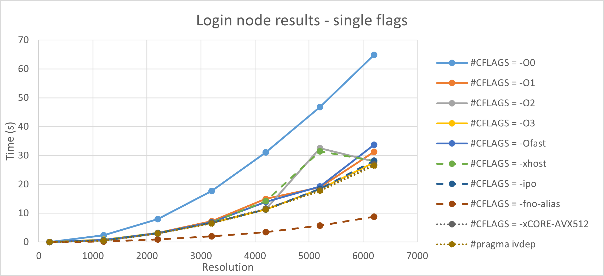
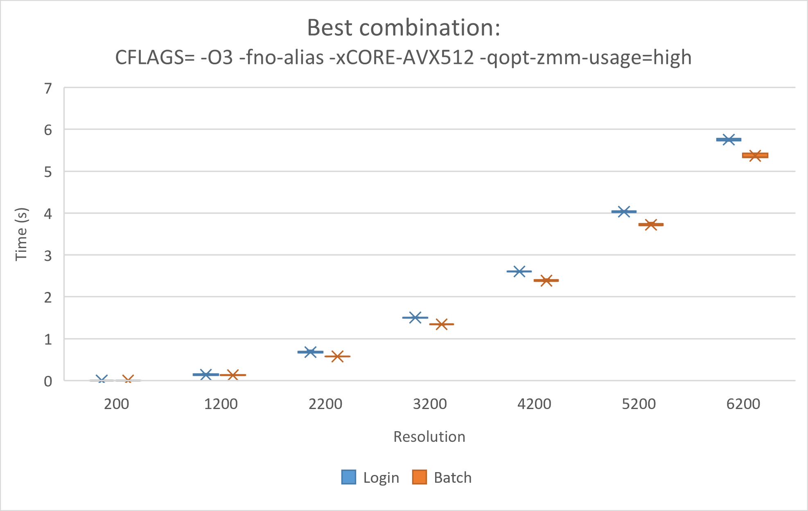

# Assignment 1 - Answers

## 1.1 Understanding the code

### 1.1.1 Obtain the initial performance data
Included in Plot1.

### 1.1.2  Investigate how the FLOP/s metric is measured. Which floating point operations are taken into account?
```
    FLOP = total_iterations * 11.0 * x_resolution * y_resolution.
    runtime = wtime() - runtime(equals wall time at start of simulation).
    FLOPS/s = FLOP/runtime (scaled appropriately to mega-, giga-, etc).
```
How FLOPs are calculated (In relax_jacobi.c)?

1. There are 3 additions and 1 multiplication in the relax_jacobi() method, used for updating every cell, giving 4 FLOPs.

1. In residual_jacobi(), there are also 3 additions and 1 multiplication while calculating the 'unew'. Then, there is 1 subtraction while calculating 'diff' and lastly, 1 multiplication and 1 addition while updating 'sum'. So, 7 FLOPs here altogether.

1. In total, for each iteration, we use 7+4 = 11 FLOPs in total


## 1.2 Compiler Options


`-O0` : Disables all optimizations. Recommended for program development and debugging, GNU default
`-O` : Enables optimization for speed, while being aware of code size (e.g no loop unrolling)
`-O2` : Default optimization. Optimizations for speed, including global code scheduling, software pipelining, predication, and speculation. Intel default. Intel -O2 includes function inlining, while GNU does not
`-O3` : -O2 optimizations plus more aggressive optimizations such as prefetching, scalar replacement, and loop transformations. Enables optimizations for technical computing applications (loop-intensive code): loop optimizations and data prefetch. more aggressive optimizations than -O2, but not always better
`-Ofast` :- Sets certain aggressive options to improve the speed of your application. This option improves the speed of your application. It sets compiler options -O3 and includes further unsafe optimization
`-xhost` : Tells the compiler to generate instructions for the highest instruction set (e.g. AVX, SSE)a vailable on the compilation host processor. As a result the binary might not work on another processor.

### 1.2.1 What is the meaning of `-ipo`? 
Enables multi-file interprocedural optimizations (between files), e.g. inline function expansion for calls to functions defined in separate files.


### 1.2.2 What is the meaning of `-fno-alias`? 
Assume there is no aliasing in program, which allows the compiler to generate faster code. Aliasing means that a memory address can be accessed by different symbolic names (e.g. variables and pointers) Can produce unintended results if the code does not conform to the rules.

### 1.2.3 What is the meaning of "ivdep"? 

It's a pragma which instructs the compiler to ignore assumed vector dependencies. To ensure correct code, the compiler treats an assumed dependence as a proven dependence, which prevents vectorization. This pragma overrides that decision. The pragma should be sed only when the assumed loop dependencies are safe to ignore.

### 1.2.4 What is the meaning of `-xCORE-AVX512`? 
It enables Intel® AVX-512 instruction set. CORE-AVX512 is the minimum set of AVX512 instructions included in all AVX512 implementations (common to AVX-512F, AVX-512CD, AVX-512BW, AVX-512DQ and AVX-512VL, etc.). The `-qopt-zmm-usage=high` flag can also be used in conjunction to force full usage of zmm registers with 512-bits-wide operands whether the compiler finds it beneficial or not. A related flag is `-xCOMMON-AVX512`.


### 1.2.5 The Intel compiler provides reports when using "opt-report" option. Remember that only relax_jacobi.c is relevant for the overall performance. What does it tell you, and what does it mean?
Use the following options to trigger opt-report: -qopt-report-annotate -qopt-report-phase=vec,loop. Copy the output for relax_jacobi and explain what it tells you.

`opt-report` : generate an optimization report to stderr.
`opt-report: -qopt-report-annotate -qopt-report-phase=vec,loop`

### 1.2.6 Is the code vectorized by the compiler? 

**TODO**

### 1.2.7 What does it mean by `-qopt-zmm-usage`?

It is used in conjunction with `-xCORE-AVX512` and defines a level of zmm registers usage. The low setting causes the compiler to generate code with zmm registers very carefully, only when the gain from their usage is proven. The high setting causes the compiler to use much less restrictive heuristics for zmm code generation.
It is not always easy to predict whether the high or the low setting will yield better performance. Programs that enjoy high performance gains from the use of xmm or ymm registers may expect performance improvement by moving to use zmm registers. However, some programs that use zmm registers may not gain as much or may even lose performance. We recommend that you try both option values to measure the performance of your programs.
This option is ignored without `-xCORE-AVX512` or `-xCOMMON-AVX512`.
This option has no effect on loops that use pragma omp simd simdlen(n) or on functions that are generated by vector specifications specific to CORE-AVX512.

### 1.2.8 What is the performance result of these options. Present a graph as outlined in the meeting.


### 1.2.9 Is there any performance variability you found as presented in the SuperMUC NG presentation.
Yes, there is variability as shown in the plot below, however surprisingly it appears higher on the compute node. This is perhaps just a random occurence due to the small number of repetitions (5).

## 1.3 Batch Processing
The performance on the *compute* node is slightly better than on the *login* node, probably due to less overhead.


