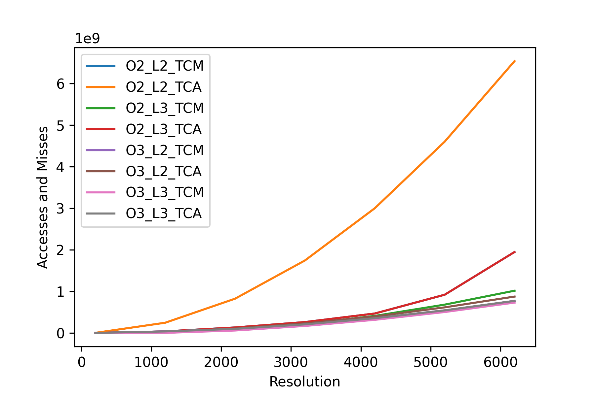
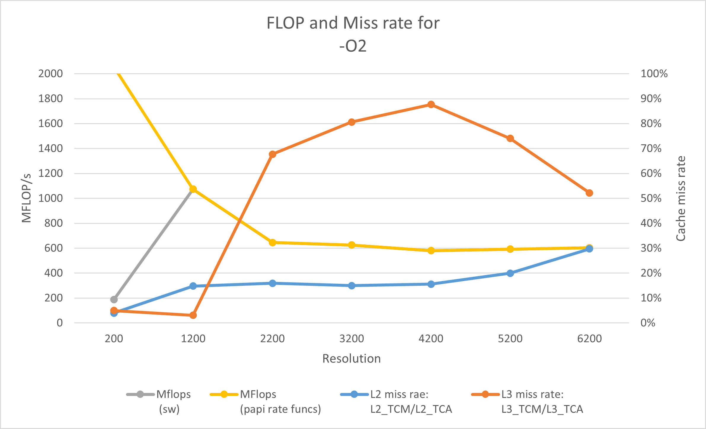
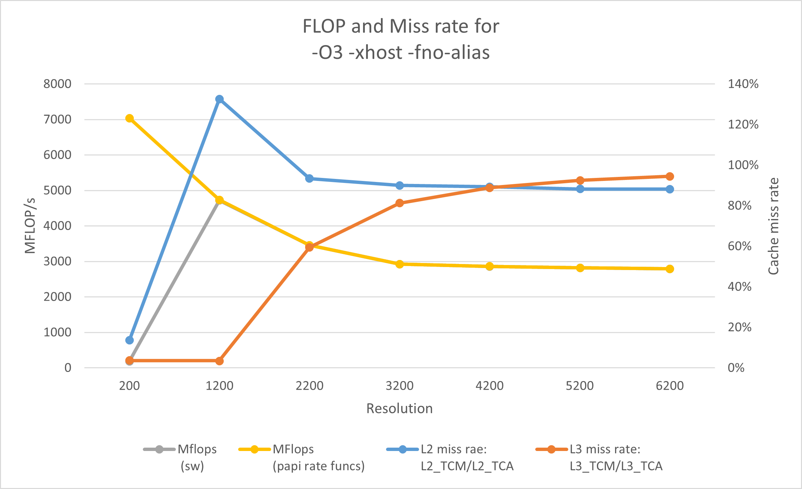

## Task 1

## Task 2

### Setup

To build the code with PAPI and compiler flags `-O2`:

```
[module load papi] #if not done
make clean
make papiO2 # to measure using flags for HL interface
# or
make papiO2_rate # to measure using rate functions
```

To build the code with PAPI and compiler flags `-O3 -xhost -fno-alias`:

```
[module load papi] #if not done
make clean
make papiO3 # to measure using flags for HL interface
# or
make papiO3_rate # to measure using rate function
```

To execute on SUPERMUC to measure with flags use:
```
sbatch job_cache.scp # for cache misses
# or 
sbatch job_ops.scp # for FLOPS
```

For measuring using the rate functions, either .scp can be used.

### Solutions

#### 1.1

Refer directory "gprof" inside "pos_21_group12/assignment2/heat_base"

#### 1.2

The functions that take most of the time are "relax_jacobi" and "residual_jacobi"

#### 1.3

It will run a bit slower than normal because it spents time in collecting and writing the data. For the present task, it had a very minor impact on the performance.

#### 1.4

The application must be compiled with "-g" and "-a" in addition to "-pg" to count how many times it executed each iteration of each 'for', 'while', 'do-while' loop.

#### 1.5

gprof is poorly suited for parallel applications. There is a possibility to use it in MPI applications as per LRZ documentation (https://www.lrz.de/services/compute/supermuc/tuning/gprof/)

#### 1.6

With gcc compiler, only Flat Profile is listed under output.
With icc compiler, output contains both Flat Profile and Call Graph

#### 2.1


#### 2.2



#### 2.3


### 2.4

The MFLOP rates computed by the program and HW counters are very similar. Small differences are observed for the smallest resolution. A possible explanations stems from the fact that the hardware counter initialization is after the start of the software clock, which results in a slight overhead which is noticeable in the lowest resolution.

#### 2.5

There are 2 sources of obtaining the processor clock frequency from the PAPI measurement logs

    1. The clock frequency from manufacturer specifications is given by the field "cpu in mhz" in the report, which here is 2701 MHz.

    2. The second source is obtained by using the fields "cycles" and "perf::TASK-CLOCK" from the reports using the relation:
        Frequency (MHz) = cycles / (perf::TASK-CLOCK / 1000).

        As an example, for the resolution of 200 points, the frequency obtained is:

        23852508 / (8854744/1000) = 2694 MHz, which roughly matches the manufacturer specs.

#### 2.6

From the PAPI reports, it can be concluded that the code was indeed vectorized for both the versions as the field "PAPI_VEC_DP" has a high value in both cases. The number of vector operations used varies between the two compiled versions because -O3 uses additional optimizations as comapared to -O2 
