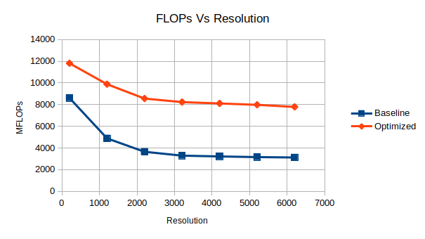
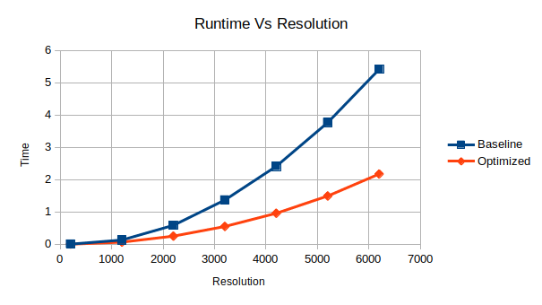
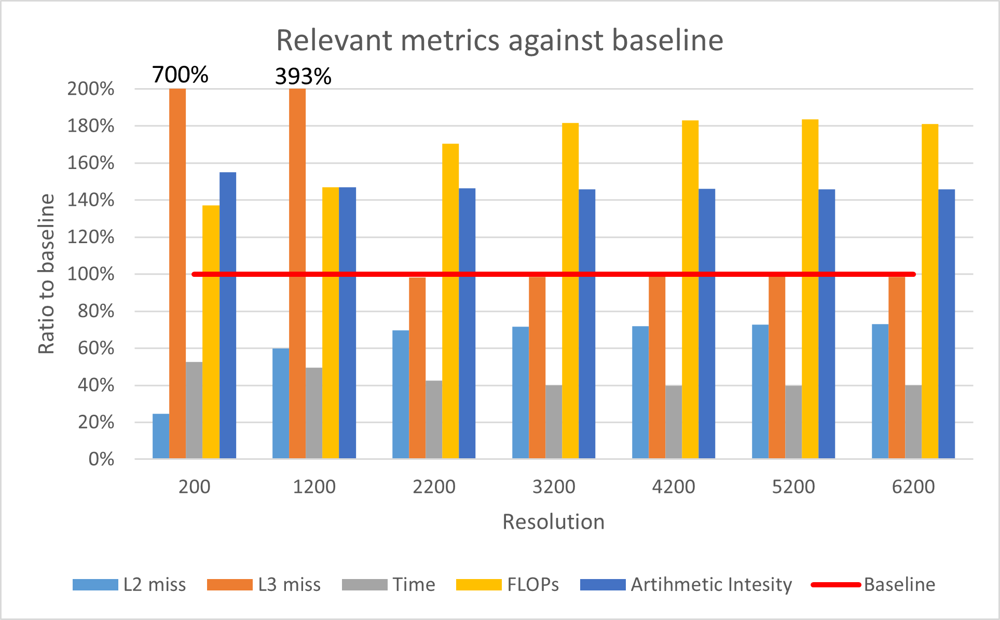

### Solutions

#### 3.1

Refer to the files, "heat.c" and "relax_jacobi.c" for the modifications.

For performance comparisons, please refer to the graphs:

The number of FLOPs was indeed affected by our transformations (loop fusions). The effective number of FLOPs per iteration decreased to 7, from the initial 11.

#### 3.2