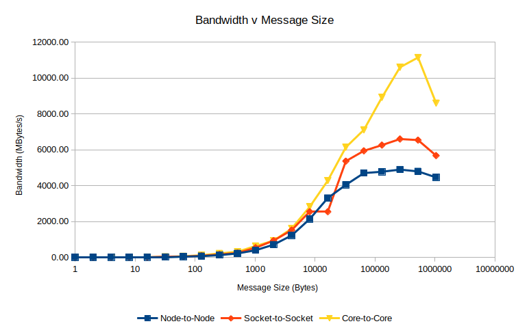
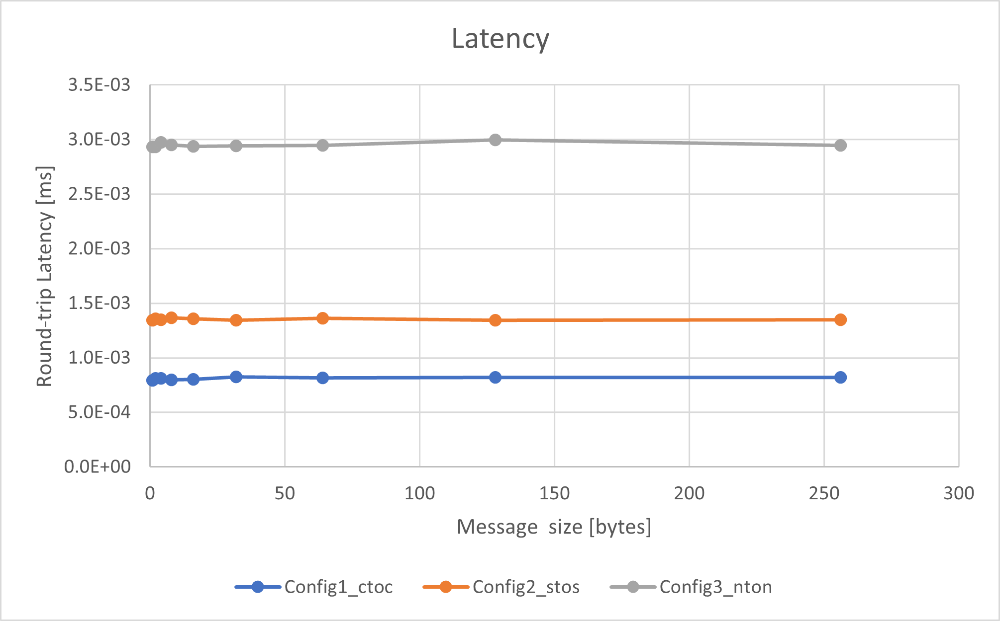

## Compiling the Program
1. make clean
2. make

## Running in different configurations
See [communication_enforcement](communication_enforcement.md)

## Measurement results
See [measurements](measurements/), raw results in [mpiexec](measurements/mpiexec)

## Plots

